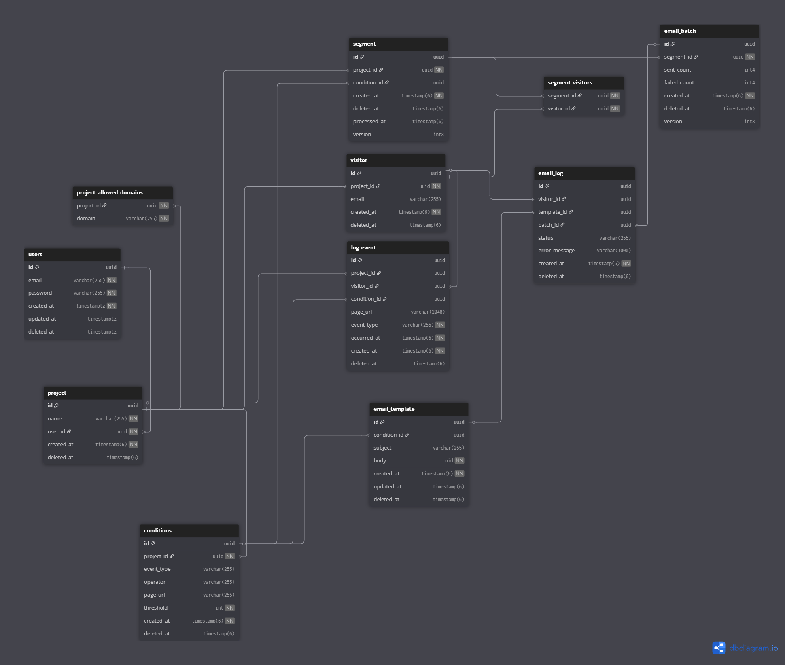
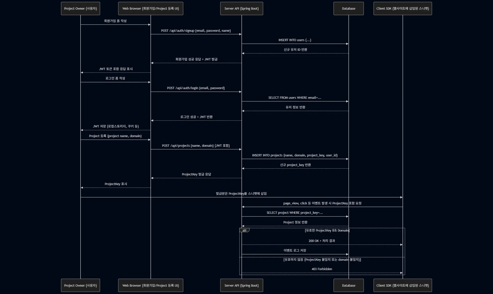

# 🏅 VisiLog

> 방문자(Visitor)의 행동을 추적하고,  
> 여러분의 비즈니스를 더 바쁘게(Busy) 만들어주는 Behavior Trigger 서비스 (MVP)

---

## 프로젝트 개요

Cursor IDE의 결제 페이지에 들어갔다가 결제하지 않고 이탈한 후,  
“혹시 도움이 필요하신가요?”라는 개인화된 이메일을 받은 경험이 있었습니다.  
단순한 ‘페이지 진입’이라는 행동 하나로 사용자에게 적절한 메시지를 보낼 수 있다면,  
전환율을 높이는 데 매우 효과적일 수 있다는 문제의식을 갖게 되었습니다.

**VisiLog**는 이 문제를 해결하기 위해 만들어졌습니다.

---

## 사용자 Pain Point와 해결 전략

### Pain Point
- 유저가 결제 페이지까지 진입했음에도 **후속 조치가 이루어지지 않아 전환 기회를 놓치는 상황**
- 특정 행동을 반복하거나, 이탈 조짐이 보이는 사용자에 대해 **실시간 대응이 어려운 구조**

### 해결 방안
- **SDK를 웹사이트에 삽입**해 방문자의 행동을 수집  
- **조건 판별 로직을 서버에서 수행**하여, 특정 이벤트 조건 충족 여부를 판단  
- 조건을 만족한 사용자를 **자동으로 세그먼트로 분류**  
- **SendGrid API를 통해 맞춤형 이메일 자동 발송**

### 기획 및 유저 스토리
- “나는 웹사이트 운영자로서, 특정 페이지를 3번 이상 방문한 사용자에게 자동 메일을 보내고 싶다.”
- “방문자가 결제 페이지까지 갔지만 이탈한 경우, 이메일로 후속 제안을 하고 싶다.”

---
## 핵심 기능 설명

VisiLog는 사용자 이탈 시점에 자동 대응할 수 있도록, 웹사이트의 행동 데이터를 수집하고 조건 기반으로 마케팅 자동화를 실현하는 데 필요한 기능들을 제공합니다.

우선, 웹사이트에 삽입 가능한 **경량 SDK를 직접 구현**하여, 방문자의 행동 로그(page_view, click 등)를 자동으로 수집합니다.  
이 SDK는 웹사이트에 제공된 스니펫을 삽입하는 방식으로 간단히 적용할 수 있으며, 수집된 이벤트는 REST API를 통해 서버에 전달됩니다.

서버는 이 데이터를 바탕으로, 사용자가 정의한 **마케팅 조건**을 실시간으로 판단합니다.  
예를 들어, 특정 URL을 60초 이상 방문하거나 특정 버튼을 클릭한 사용자를 대상으로 설정할 수 있습니다. 이러한 조건은 관리자가 직접 등록할 수 있도록 API로 제공합니다.

조건을 만족한 방문자는 자동으로 **세그먼트(조건에 부합하는 사용자 그룹)로 분류**됩니다. 세그먼트는 스케줄러를 통해 업데이트됩니다.

세그먼트에 포함된 방문자에게는 **사전에 설정된 이메일 템플릿을 기반으로 자동 발송**이 이루어집니다. 이메일은 스케줄러가 주기적으로 세그먼트를 확인해, SendGrid API를 통해 자동 발송됩니다.  
이를 통해 운영자는 직접 메일을 보내지 않아도, 조건을 만족한 유저에게 맞춤형 메시지를 전달할 수 있습니다.

**도메인 인증 기능**도 포함되어 있어, 허용되지 않은 도메인에서 SDK 요청이 들어올 경우 인터셉터가 이를 차단합니다.  
모든 관리자 API는 JWT 기반 인증 구조로 보호되며, Swagger를 통해 테스트 가능한 명세 문서도 자동 생성되어 있습니다.

이 모든 구성은 마케터가 코드 수정 없이도 타겟팅 마케팅을 자동화할 수 있도록 설계되어 있습니다.


---

## 기술 스택

- **백엔드**: Java 17, Spring Boot 3.4.4, JPA 3.4.4, PostgreSQL 16
- **배포**: Render (서버), Vercel (SDK)
- **문서화**: Swagger (springdoc-openapi)
- **기타**: GitHub Actions (CI), Docker (Render용)

---

## API 명세 요약

- `POST /api/visitors` : 방문자 생성
- `POST /api/conditions` : 조건 생성
- `POST /api/segments` : 세그먼트 생성
- `POST /api/segments/{id}/send-email` : 조건 충족 세그먼트 대상 이메일 자동 발송
- 전체 명세: **[Swagger 문서](https://sdk-behavior-trigger-mvp.onrender.com/swagger-ui/index.html)**

---

## ERD (Database Schema)

[✔ ERD 보기](https://dbdiagram.io/d/sdk-behavior-trigger-mvp-67fb965b4f7afba184664689)


- 총 12개 테이블(users, projects, visitors, logs, conditions, segments, email_template, email_batch, email_log 등)
- trigger 기반 설계 구조

---

## 개발 프로세스

**VisiLog 프로젝트는 유저 스토리 기반의 기능 단위 개발 방식**으로 진행되었습니다.  
기획 → 설계 → 구현 → 테스트까지의 전체 흐름을 단계적으로 관리했습니다.

### 개발 단계

1. **에픽 정의**
    - 주요 기능 영역을 에픽 단위로 나눔 (예: 방문자 추적, 조건 설정, 이메일 발송 등)

2. **유저 스토리 도출**
    - 각 에픽을 사용자의 입장에서 유저 스토리로 세분화
    - 예: "방문자로서 내가 사이트를 방문하면 행동 로그가 수집된다"

3. **유저 시나리오 작성**
    - 시나리오 기반 흐름 설계 (조건 만족 → 세그먼트 생성 → 이메일 발송 등)

4. **ERD 설계**
    - 유저 시나리오에 필요한 데이터 구조 설계
    - dbdiagram.io를 활용한 테이블 정의 및 관계 매핑

5. **시퀀스 다이어그램 설계**
    - 유저 액션에 따른 백엔드 흐름을 시각화
    - mermaid.js 기반으로 API 흐름 설계


6. **API 명세 작성**
    - Swagger 기반 REST API 문서화
    - 요청/응답 스펙, 상태 코드, 예외 케이스 정의

7. **기능 구현**
   - 실제 구현은 다음과 같은 순서로 진행:
    1) **Entity**: 먼저 도메인 모델 정의 및 관계 설정
    2) **Repository**: 엔티티 기반 CRUD 인터페이스 구성
    3) **DTO**: 요청/응답 데이터를 분리하여 정의
    4) **Service**: 핵심 비즈니스 로직 구현
    5) **Controller**: REST API 엔드포인트 구성 및 매핑
    - 계층적 구조를 기반으로 각 단계를 테스트하며 개발 진행

8. **통합 테스트 및 CI 구성**
    - Spring MockMvc를 활용한 통합 테스트
    - GitHub Actions로 자동 테스트 및 빌드 파이프라인 구성

---

### Git 전략

- **기능별 브랜치**: `feat/*`
- **통합 브랜치**: `dev`
- **배포용 메인 브랜치**: `main`
- PR 머지 전 테스트 → `dev` 통합 → `main` 릴리즈 방식 유지


## 테스트 전략

- SecurityContext 설정 오류 해결 경험 보유
- MockMvc를 활용한 통합 테스트
- GitHub Actions CI에 테스트 연동

---

## 향후 계획

- Admin 대시보드 UI
- 방문자 통계 시각화 (차트 라이브러리 연동)
- Redis 기반 조건 캐싱 최적화
- MQ 기반 이메일 발송 비동화 (RabbitMQ or BullMQ)
- OAuth2 인증 연동 (Google, Kakao, GitHub)

---

## 배포 및 접근

- **SDK 배포 URL (Vercel)**:  
  - [SDK 배포 링크](https://behavior-tracking-sdk.vercel.app/sdk.js)
  - [SDK GitHub](https://github.com/SungHuii/behavior-tracking-sdk)


- **Swagger API 문서**:  
  - [Swagger 문서](https://sdk-behavior-trigger-mvp.onrender.com/swagger-ui/index.html)

---


## 프로젝트 구조

```
src
├── main
│ ├── java/com.behavior.sdk.trigger
│ │ ├── common # 공통 기능 (Interceptor, Security)
│ │ │ ├── interceptor # 요청 인터셉터
│ │ │ └── security # JWT 인증/인가 처리
│ │ ├── config # Web/Security 설정 클래스
│ │ ├── condition # 조건 등록/조회/삭제 (Condition 도메인)
│ │ ├── email # 이메일 발송 API
│ │ ├── email_log # 이메일 발송 로그 처리
│ │ ├── email_template # 이메일 템플릿 관리
│ │ ├── log_event # 방문자 행동 로그 기록
│ │ ├── project # 프로젝트 생성/수정/삭제
│ │ ├── segment # 조건 기반 방문자 그룹 관리
│ │ ├── user # 회원가입, 로그인 등 인증 관련
│ │ ├── visitor # 방문자 생성 및 정보 저장
│ │ ├── web # WebMvc 관련 설정 등
│ │ └── TriggerApplication # 메인 실행 클래스
│ └── resources
│ ├── static
│ ├── application.yml
│ ├── application-dev.yml
│ └── application-local.yml
├── test # 통합 테스트
```

---

## 만든 사람

- 개발자: [홍성휘](https://github.com/SungHuii)
- 이메일: gkemg2017@gmail.com
